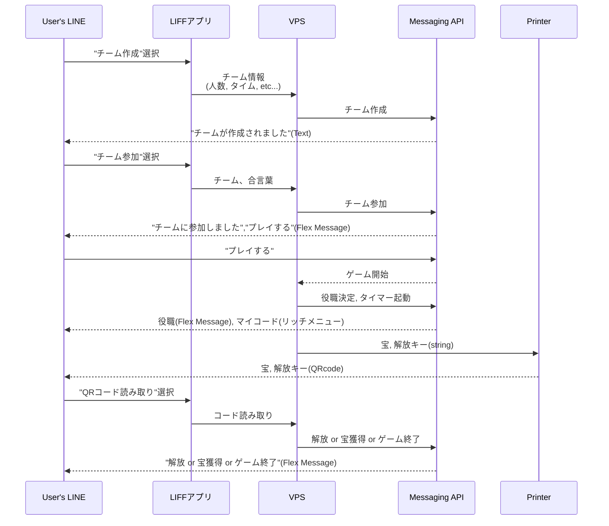

```mermaid
sequenceDiagram
    User's LINE->>LIFFアプリ: "チーム作成"選択
    LIFFアプリ->>VPS: チーム情報 <br /> (人数, タイム, etc...)
    VPS ->>Messaging API: チーム作成
    Messaging API -->> User's LINE: "チームが作成されました"(Text)
    User's LINE ->> LIFFアプリ: "チーム参加"選択
		LIFFアプリ ->> VPS: チーム、合言葉
		VPS ->> Messaging API: チーム参加
		Messaging API -->> User's LINE: "チームに参加しました","プレイする"(Flex Message)
		User's LINE ->> Messaging API: "プレイする"
		Messaging API -->>VPS: ゲーム開始
		VPS ->> Messaging API: 役職決定, タイマー起動
		Messaging API -->> User's LINE: 役職(Flex Message), マイコード(リッチメニュー) 
		VPS ->> Printer: 宝, 解放キー(string)
		Printer -->> User's LINE: 宝, 解放キー(QRcode)
		User's LINE ->> LIFFアプリ: "QRコード読み取り"選択
		LIFFアプリ ->> VPS: コード読み取り
		VPS ->> Messaging API: 解放 or 宝獲得 or ゲーム終了
		Messaging API -->> User's LINE: "解放 or 宝獲得 or ゲーム終了"(Flex Message)
```